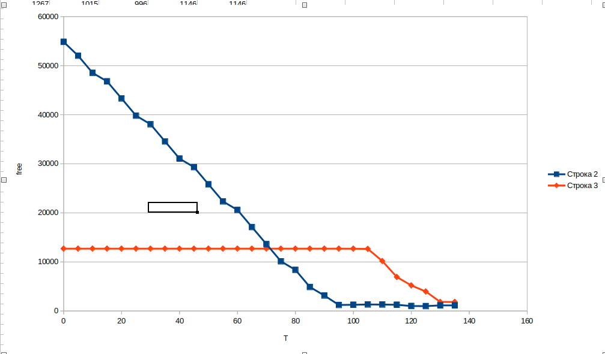
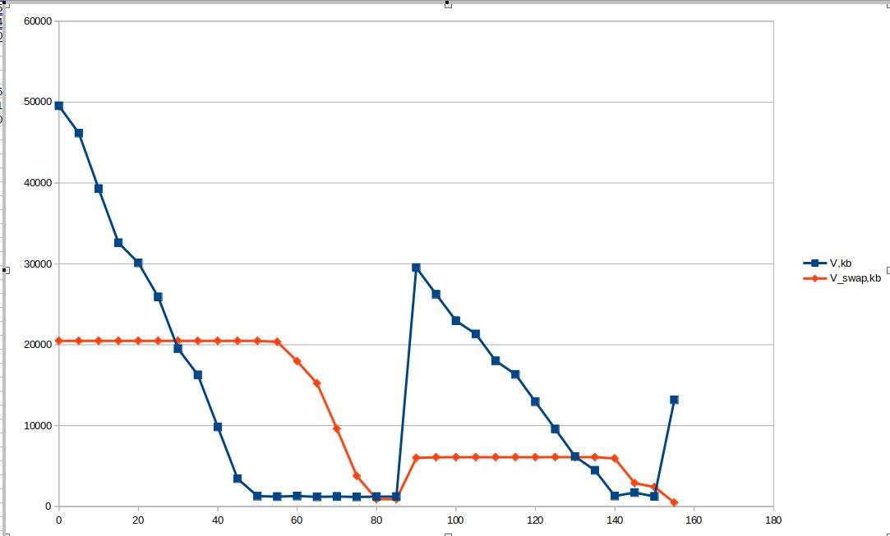
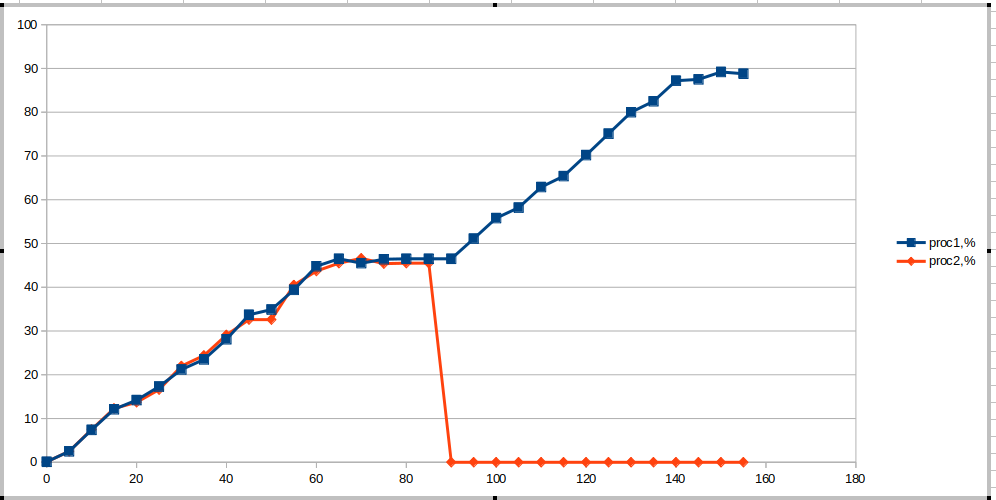

# Отчёт по лабораторной работе №5

Общие сведения о памяти:

Общий объём оперативной памяти --- 7081580 kB

Общий объём раздела подкачки --- 2097148 kB

Размер страницы виртуальной памяти --- 4096 kB

Объём свободной физической памяти в не нагруженной системе --- 5485128  kB

Объём свободного пространства в разделе подкачки в не нагруженной системе--- 2097148 kB

## Задание №1

### Подготовительный этап

mem.bash:

```
#!/bin/bash

array=()

part=(1 2 3 4 5 6 7 8 9 10)

c=0

echo "" > report.log

while true; do

	array+=(${part[@]})

	let c++

	if [[ $c == 100000 ]]; then

		echo "${#array[@]}"

		c=0

		echo "${#array[@]}" >> report.log

	fi

done
```

### Первый этап

report.log --- 98000000




Большую часть времени большую часть и ресурса процессора потреблял mem.bash, но когда была уже поглощена почти вся память из раздела подкачки, в топ-5 процессов вылезли snapd и kswapd0. Первая отвечал за пакеты нужные определённому процессу, а вторая, которая при всей съеденной памяти занимает первое место по потреблению СРU, отвечает за командование виртуальной памятью, что всё объясняет.

Процессу было выделено 7723580kB виртуальной памяти, что почти соответствует суммарно свободной памяти в ненагруженном состоянии.

Out of memory: Killed process 6604 (bash) total-vm:7723580kB, anon-rss:6494324kB, file-rss:0kB, shmem-rss:0kB, UID:1000 pgtables:15140kB oom\_score\_adj:0

**Вывод:Из графиков видно, что процесс изначально поглощает саму оператичную память,после того, как она закончилась, он обращается к отделу подкачки. После опустошения отдела подкачки, процесс ещё раз запрашивает память, но уже происходит вынужденное убийство этого процесса.**

### Второй этап

report.log-10000000

report2.log-49000000






Вывод:Из полученных данных можно сделать вывод о том, как работали процессы. В начале им обоим одинаково выделялась оперативная память, когда она закончилась, выделялась память из раздела подкачки, затем второй процесс аварийно завершился, т. к. он сделал запрос на выделение ему памяти, а памяти ему не было, первый продолжил работать штатно, т. к. теперь освободилась память.


## Эксперимент 2.

1. N = 9800000; k = 10; Все процессы завершились корректно. Это объясняется тем, что процессы могут достичь суммарно критических 98000000 элементов, если будут выполняться одновременно и максимум наберут в один момент

2. N = 9800000; k = 30; 17 процессов завершили работу аварийно, это объясняется тем, что при 30 процессах суммарное количество элементов в одно время может превышать критическое значение, при котором заполняется вся память, и в такие моменты приходится аварийно завершать некоторые процессы.

3. k = 30; N=7800000 --- 13 аварийных процессов

k = 30; N=6800000 --- 9 аварийных процессов

k = 30; N=5800000 --- 0 аварийных процессов

k = 30; N=6300000 --- 5 аварийных процессов

k = 30; N=6000000 --- 0 аварийных процессов

**N = 6000000**

Вывод: Были изучены механизмы управления памятью в linux, поведение процессов в критических ситуациях,


